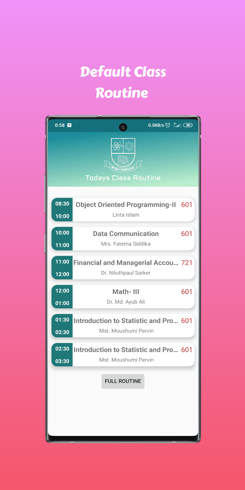

# CSE10 — Android App for JnU CSE

A simple, distraction-free Android app to share class routines, post updates (with images), and crowdsource a Google-Drive–powered e-library for the Department of CSE, Jagannath University. Built natively for Android.

[**⬇️ Download APK (≈12 MB)**](https://github.com/NaheedRayan/Java/blob/master/app-debug.apk)

> Installed app size: \~17.8 MB
> Works offline for core views.

---

## Table of Contents

* [Motivation](#motivation)
* [Features](#features)
* [Screenshots](#screenshots)
* [Tech Stack](#tech-stack)
* [Getting Started](#getting-started)
* [Build & Run](#build--run)
* [Usage](#usage)
* [Data & Privacy](#data--privacy)
* [Roadmap](#roadmap)
* [Contributing](#contributing)
* [Team & Thanks](#team--thanks)
* [License](#license)

---

## Motivation

CSE10 began during quarantine as a lightweight tool for our Batch-10 to check the next day’s class routine **without getting pulled into social media**. It grew into a department-wide app after encouragement from our respected **Zulfiker Mahmud** sir. The goal is straightforward: *a minimal, reliable companion for class schedules, announcements, and a shared book archive*.

---

## Features

* **Daily Class Routine**

  * See the default routine for the current day at a glance.
  * Post routine updates with optional images; authors can delete their own posts.

* **Posts with Images**

  * Upload images for announcements; images are auto-compressed (quality ≈ 20) to keep the app fast and data-friendly.

* **Book Archive (Community E-Library)**

  * Add **Google Drive** links to PDFs or other files.
  * Build a shared, growing e-library with contributions from everyone.

* **Account & Convenience**

  * Custom **Sign-In** with a **Remember me** option.
  * Works **offline** for core browsing.

* **Simple, Clean UI**

  * Focused on clarity and speed over flashy elements.

---

## Screenshots

## Screenshots

  
<b>Tap to expand (10 screenshots)</b>

<table>
<tr>
<td></td>
<td></td>
<td></td>
<td></td>
<td></td>
</tr>
<tr>
<td></td>
<td></td>
<td></td>
<td></td>
<td></td>
</tr>
</table>

## Tech Stack

* **Platform:** Android (Native)
* **Language:** Java (Android Studio project)
* **Storage/Links:** Google Drive links for shared resources
* **Image Handling:** On-device compression (quality ≈ 20) for uploaded post images

---

## Getting Started

1. **Download**

   * Grab the latest APK:
     👉 [app-debug.apk](https://github.com/NaheedRayan/Java/blob/master/app-debug.apk)

2. **Install**

   * Transfer the APK to your Android device.
   * Enable “Install unknown apps” for your file manager (if needed).
   * Open the APK to install.

> **Note:** If your device warns about unknown sources, proceed only if you trust this build and source.

---

## Build & Run

If you want to build from source:

1. **Prerequisites**

   * Android Studio (latest stable)
   * Android SDK + Build Tools
   * JDK 8+ (as required by your Android Studio setup)

2. **Steps**

   * Clone the repo.
   * Open the project in Android Studio.
   * Let Gradle sync.
   * Connect a device or start an emulator.
   * **Run ▶** (Debug/Release as needed).
   * To generate an APK: **Build → Build Bundle(s) / APK(s) → Build APK(s)**.

---

## Usage

* **Sign In**: Create or use your account; you can enable **Remember me**.
* **Routine**: Open the **Class Routine** tab to see today’s schedule by default.
* **Post**: Share an update; optionally attach an image (it’ll be compressed automatically).
* **Manage**: Authors can delete their own posts.
* **Archive**: Add or open **Google Drive** links to books/notes; help grow the shared library.
* **Offline**: Browse core sections even without internet; some actions (e.g., adding links) may require connectivity.

---

## Data & Privacy

* Uploaded images are compressed on the device to reduce size and bandwidth.
* Book Archive items are **links** (e.g., Google Drive); files are not hosted by this app.
* Please share only content you have the right to distribute.
* No unnecessary permissions are requested; internet access is used for posting and opening links.

---

## Roadmap

* 🔎 Search for routines, posts, and archive entries
* 🔔 Optional notifications for routine changes
* 🗂️ Categories/tags for Book Archive
* 🌐 Multi-batch / multi-department scaling
* 🧹 Admin tools (moderation, bulk cleanup)

> Have ideas or want to help? See [Contributing](#contributing).

---

## Contributing

Contributions are welcome!

1. **Fork** the repo
2. **Create a branch**: `git checkout -b feature/your-feature`
3. **Commit** your changes: `git commit -m "Add: your feature"`
4. **Push** the branch: `git push origin feature/your-feature`
5. **Open a Pull Request**

Please keep PRs small and focused. For larger changes, open an issue first to discuss.

---

## Team & Thanks

* **Lead/Dev:** *You* (Project initiator, Android — native)
* **Graphics:** **Md. Ashrafuzzaman Abir** — designed most UI elements; also a great teammate with a sharp sense of humor
* **Testing & Graphics Support:** **A.Y. Siam** — lead tester; brought energy and thorough QA
* **Mentor:** **Zulfiker Mahmud Sir** — for the pivotal encouragement to expand beyond a single batch

Special thanks to everyone who tested and shared feedback during the early quarantine builds. 💙

---

## License

This project’s license is not yet specified. If you intend the code to be open-source, consider adding a `LICENSE` file (e.g., MIT, Apache-2.0). Until then, **all rights reserved** by default.

---

## Contact

* Issues & requests: open a **GitHub Issue**
* General inquiries: add your preferred contact/email or social links here

---

**Built with care for the CSE community at Jagannath University.** 🚀
